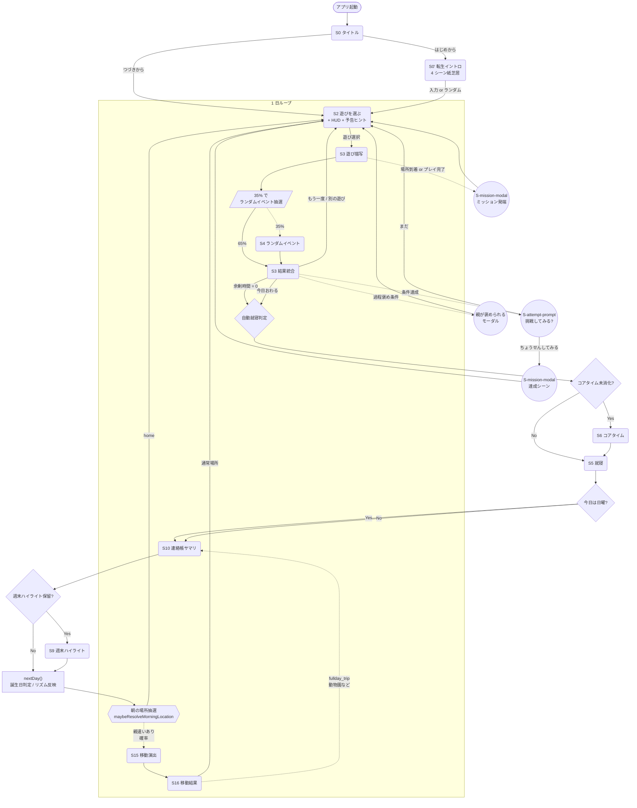
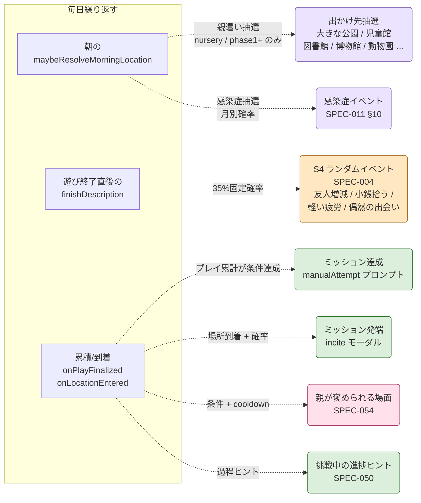
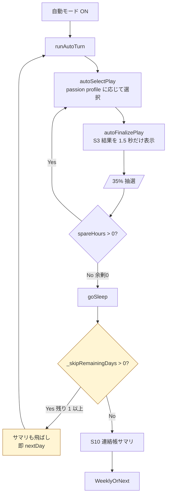
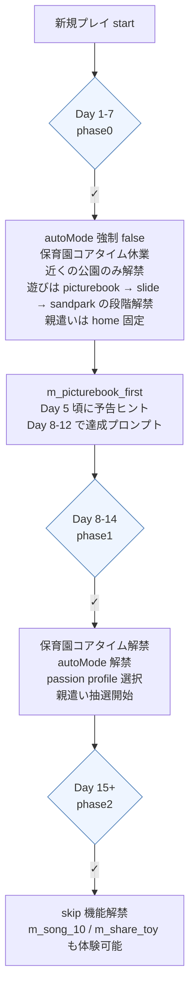
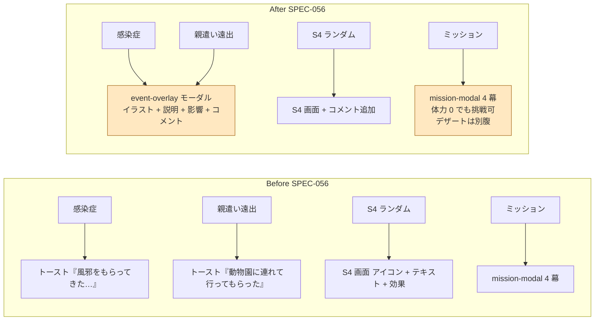
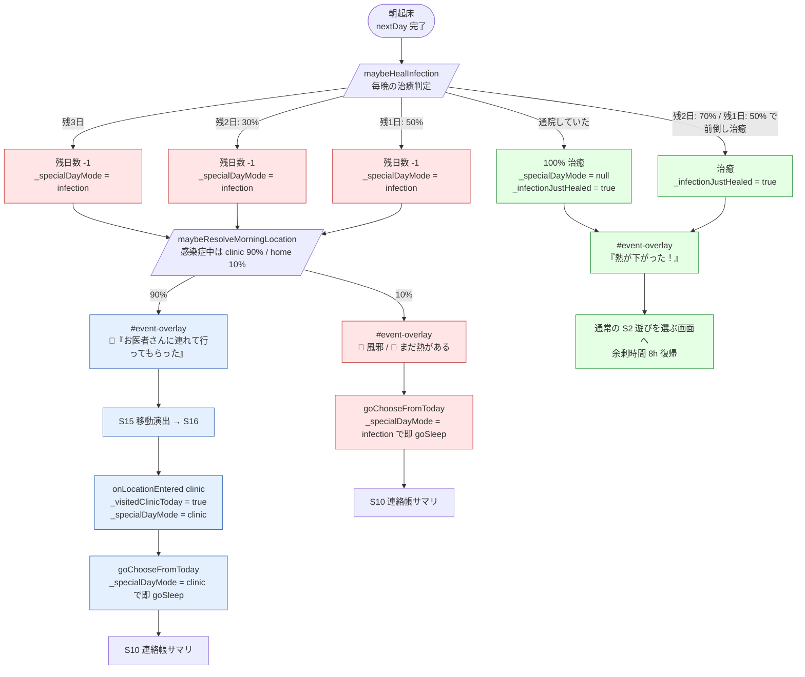

# ゲームフロー全体図

> ユーザーがゲーム内で実際にたどる **画面遷移とイベント発火タイミング** を Mermaid 形式で整理した図。
> 「繰り返すところ」「ランダムで発生するところ」「分岐するところ」を可視化することが目的。

## 凡例

| 記号 | 意味 |
|---|---|
| 角丸長方形 (`(...)`) | **画面**（プレイヤーが実際に見るスクリーン） |
| ひし形 (`{...}`) | **分岐**（条件で進路が変わる） |
| 平行四辺形 (`[/.../]`) | **ランダム抽選**（確率で発火） |
| 角丸破線 | **モーダル/オーバーレイ**（画面遷移ではなく上に重なる） |
| 太い実線 | 必ず通るパス |
| 点線 | 確率で通るパス |

## 1. 全体フロー（俯瞰図）



## 2. 1 日ループ（拡大図）

> 上の図の `DayLoop` 部分を詳細化。**繰り返し** が一番多く発生する中核ループ。

```mermaid
flowchart TD
    Wake([朝起床<br/>nextDay 完了]) --> MorningRoll[/maybeResolveMorningLocation<br/>親遣い抽選/]

    MorningRoll --> SkipCheck{スキップ中?<br/>_skipRemainingDays > 0<br/>or _skipTargetDay >= today}
    SkipCheck -->|Yes| HomeFix[location = home 固定]
    SkipCheck -->|No| StageCheck{保育園期?}

    StageCheck -->|No| HomeFix
    StageCheck -->|Yes, phase0| HomeFix
    StageCheck -->|Yes, phase1+| WeekendCheck{平日 or 土日?}

    WeekendCheck -->|平日| WeekdayPick[/重み抽選<br/>home / near_park / big_park /<br/>children_hall / library/]
    WeekendCheck -->|土日| WeekendPick[/40% 家 / 60% 遠出<br/>museum / aquarium / zoo …/]

    WeekdayPick --> ParentalCheck{home 以外?}
    WeekendPick --> ParentalCheck

    ParentalCheck -->|home| ChooseS2
    ParentalCheck -->|遠出| Travel15(S15 移動演出<br/>1.6 秒)
    HomeFix --> ChooseS2

    Travel15 --> Travel16(S16 移動結果)
    Travel16 -->|通常場所| ChooseS2(S2 遊びを選ぶ)
    Travel16 -.->|fullday_trip<br/>zoo, museum など| FullDay[runFullDayEvent<br/>素養一括加算 + S10 直行]
    FullDay --> S10A(S10 連絡帳サマリ)

    ChooseS2 --> RenderHints[renderPreviewHint<br/>renderMissionBanner]
    RenderHints --> SelectPlay{遊びを選ぶ}
    SelectPlay -->|選択| StartPlay(S3 遊びの描写<br/>2.2 秒の演出 or ムービー)

    StartPlay --> EventDice[/finishDescription<br/>Math.random < 0.35/]
    EventDice -->|65%| Finalize[finalizePlay<br/>素養加算・スキル経験値]
    EventDice -.->|35%| RandomEvent(S4 ランダムイベント<br/>友人増減・小銭・体調…)
    RandomEvent --> Finalize

    Finalize --> StaminaCheck{体力 = 0?}
    StaminaCheck -->|Yes| ForceSleep[handleStaminaDepleted<br/>強制就寝]
    StaminaCheck -->|No| Triggers

    Triggers[onPlayFinalized<br/>累積カウント / ミッション判定 / 称号] --> MissionPath{達成 / 発端あり?}

    MissionPath -.->|達成<br/>manualAttempt| AttemptPrompt(S-attempt-prompt<br/>ちょうせんしてみる?)
    MissionPath -.->|発端<br/>確率発動| InciteModal(S-mission-modal<br/>はじまり)
    MissionPath -->|なし| ResultActions

    AttemptPrompt -->|うたってみる| AccompModal(S-mission-modal<br/>達成 + 報酬)
    AttemptPrompt -->|まだ| ResultActions
    InciteModal --> CatalystModal(S-mission-modal<br/>触媒)
    CatalystModal --> ResultActions
    AccompModal --> ResultActions

    ResultActions[S3 結果アクション選択]
    ResultActions -->|もう一度| StartPlay
    ResultActions -->|別の遊び| ChooseS2
    ResultActions -->|今日おわる<br/>or 余剰 0| EndOfDay
    ForceSleep --> EndOfDay

    EndOfDay --> CoreTimeCheck{コアタイム未消化?}
    CoreTimeCheck -->|Yes 保育園期| S6(S6 コアタイム<br/>保育園 09:00-16:00)
    CoreTimeCheck -->|No| GoSleep[goSleep]
    S6 --> GoSleep

    GoSleep --> Sunday{日曜?}
    Sunday -->|Yes| MarkWeekly[_pendingWeeklyHighlight = true]
    Sunday -->|No| AutoOrManual
    MarkWeekly --> AutoOrManual{autoMode<br/>or 保育園期?}

    AutoOrManual -->|Yes| S10(S10 連絡帳サマリ)
    AutoOrManual -->|No 大人| S5(S5 就寝<br/>モード選択)
    S5 -->|早寝/普通/夜更かし| NextDayCall
    S10 --> S10Continue{つづける}
    S10Continue --> WeeklyHL{週末ハイライト保留?}
    WeeklyHL -->|Yes| S9(S9 週末ハイライト<br/>今週のがんばり)
    WeeklyHL -->|No| NextDayCall
    S9 -->|つづける| NextDayCall

    NextDayCall[sleep mode → nextDay] --> Wake
```



## 3. ランダム発火イベントの整理（**今回ご質問のポイント**）

> 「遊びを選択したときのランダムイベント」と「今回実装したイベント」が混在して見えていた件を、
> **発火タイミング** で整理します。同じ「ランダム」でも **役割が違う** 4 系統です。



### 4 系統の役割と性質

| 系統 | 発火タイミング | 確率 / 条件 | 目的 | 関連 SPEC |
|---|---|---|---|---|
| **🟪 朝の場所抽選 / 親遣い** | 起床時 | 重み抽選（家 60% / 公園 25% / 児童館 …） | **「今日どこに行くか」** を決める。1 日のテーマを与える | SPEC-047 |
| **🟪 感染症イベント** | 起床時 | 月別確率（風邪は冬 8%、夏は 1% など） | 保育園期のリアリティ演出（SPEC-011 §10）。「貯める→還す」テーマの『還す』側 | SPEC-011 |
| **🟧 S4 ランダムイベント** | 遊び終了時 | **35% 固定**（SPEC-004 §5.1） | **「思いがけない 1 日のスパイス」**。友人/小銭/疲労など軽量な揺らぎ。**特定の物語を持たない単発イベント** | SPEC-004 |
| **🟩 ミッション（発端 / 達成）** | プレイ累計達成 / 場所到着 | 累積で確実 + 場所は確率（60%）<br/>**達成は manualAttempt（プレイヤー意思）** | **「数十日にまたがる物語」**。発端 → 触媒 → 挑戦 → 達成の 4 幕構造。`title_*` 報酬 | SPEC-050, SPEC-052, SPEC-055 |
| **🟩 予告ヒント（mission-prelude）** | 朝・遊び後 | 累積 70% / 80% で「near」と判定 | **「今日何かが起きそう」の枠組み** だけ伝え、内容はサプライズに保つ（RPE 設計） | SPEC-055 §1 |
| **🟩 進捗ヒント（progressHints）** | 挑戦中の任意プレイ後 | 条件式（playCountAtLeast 等） | 挑戦中ミッションの**励ましのセリフ**。「毎日少しずつ練習してきたね」 | SPEC-050 §3.4 |
| **🟩 称号自動認定** | プレイ後 / 素養変動後 | autoTrigger 条件式 | **静かなコレクション**。プロファイル（宝箱）に追加 | SPEC-051 |
| **🟪🟧 fullday_trip** | 朝に zoo/museum/aquarium 抽選時 | 場所抽選結果 | 1 日まるごと使う特別イベント。`runFullDayEvent` で S10 に直行 | SPEC-047 §7.4 |
| **🩷 親が褒められる場面** | 場所到着・プレイ後 | 条件 + cooldown（最終発火から 7 日以上） | 「親（プレイヤー）が他者から褒められる」体験。代理報酬の核（SPEC-053 §3.3） | SPEC-054 |

### S4 と ミッション系の **棲み分け要点**

> ご質問の「混在してわかりにくい」点は、両方とも **「遊びの結果に乗る」 ように見える** からですが、性質は明確に違います：

|  | **S4 ランダムイベント** | **ミッション系** |
|---|---|---|
| 物語の有無 | × 単発・記憶に残らない | ◯ 数日〜数十日にまたがる物語 |
| 発火確率 | **35% 固定** | プレイヤーの行動の積み重ねで条件達成 |
| プレイヤー操作 | 表示するだけ | 「ちょうせんしてみる？」で意思介在 |
| 報酬 | 友人 ±1 / 小銭 など軽量 | 称号 / 持続バフ / 連絡帳エピソード |
| 連絡帳記載 | × | ◯ 達成エピソードが残る |
| プロファイル記載 | × | ◯ 宝箱の「成し遂げたこと」 |

要するに **S4 は「日々の揺らぎ」**、**ミッション系は「数十日かけて育つ物語」** の役割分担です。
今後、両者をさらに区別したい場合は、S4 側を「**お天気のような偶発**」、ミッション側を「**月の満ち欠けのような周期物語**」と捉えると整理しやすいです。

## 4. 自動モード/スキップ時の差分



### スキップ機能の細分（SPEC-025 §7）

| スキップ種別 | 飛ばす範囲 | 親遣い抑制? |
|---|---|---|
| 翌日の夜まで（`skipToNextDaySummary(1)`） | 1 日分の S2 → S10 | ◯（_skipTargetDay 設定） |
| 週末まで（`skipToWeekend`） | 月〜土曜の朝までを連続自動進行 | ◯ |
| Skip during phase 0 | （phase0 は skip ボタン非表示） | – |

## 5. チュートリアル（最初の 2 週間）の差分



## 6. 画面 ID 完全リスト（参考）

| 画面 ID | 画面名 | 系統 |
|---|---|---|
| S0 | タイトル | 起動 |
| S0' | 転生イントロ | 起動 |
| S2 | 遊びを選ぶ（HUD・予告ヒント・ミッションバナー） | コアループ |
| S3 | 遊び描写 + 結果統合 | コアループ |
| S4 | ランダムイベント（35%） | コアループ |
| S5 | 就寝（大人） | 1 日終わり |
| S6 | コアタイム | 1 日中盤 |
| S7 | 遊びツリー | 寄り道 |
| S9 | 週末ハイライト（日曜夜） | 週末 |
| S10 | 連絡帳サマリ（日の終わり） | 1 日終わり |
| S15 | 移動演出 | 寄り道 |
| S16 | 移動結果 | 寄り道 |
| S-mission-modal | ミッション 4 幕モーダル | オーバーレイ |
| S-attempt-prompt | 「ちょうせんしてみる？」 | オーバーレイ |
| 親が褒められるモーダル | parental compliment | オーバーレイ |
| ミッションバナー | HUD 直下、挑戦中ミッション一覧 | HUD オーバーレイ |
| 予告ヒント | HUD 直下、「もうすぐ何か…」 | HUD オーバーレイ |

## 7. SPEC-056 で統一されたランダム発火イベントの可視化

> 上記 §3 の 4 系統を「全部同じ作りのモーダルで表現する」段階。
> 朝の感染症・親遣い遠出はトーストで簡素だったが、SPEC-056 で **イラスト + コメント + 影響リスト** の統一モーダルに昇格。



### モーダル構造（共通）

```
┌────────────────────┐
│       🤧            │ ← イラスト（emoji 大）
│  風邪をひいてしまった │ ← タイトル
│  保育園で風邪を…    │ ← 情景説明
│ ┌── 影響 ──┐        │
│ │余剰時間 -8h│        │ ← 影響リスト（色分け）
│ │感染症   +3日│       │
│ └────────┘        │
│ お母さん            │
│ ゆっくり休もうね    │ ← NPC コメント
│  [ なるほど ]       │
└────────────────────┘
```

### ミッション挑戦の体力 0 許容（デザートは別腹）

| 状態 | 旧挙動 | 新挙動（SPEC-056 §4） |
|---|---|---|
| 遊び後に体力 0 | `handleStaminaDepleted()` 即発動、ミッションプロンプト潰れる可能性 | `_pendingStaminaDepleted = true` で遅延 |
| ミッション「ちょうせんしてみる」 | 体力 0 でも演出は走るが画面競合の懸念 | プロンプト → 達成シーン → S2 復帰がスムーズに完走 |
| ミッション「まだ、こんどにする」 | 同上 | S2 ではなく **強制就寝** に直行（保留中なら） |
| 達成シーン中の素養加算 | 通常通り | 通常通り（時間・体力消費なし） |

> 「達成は身体疲労を伴わず、むしろ達成感がブースト効果として働く」
> という物語的整合性を保ちつつ、画面競合バグも回避。

## 8. SPEC-057 感染症と治癒の特殊フロー

> 風邪をひいた日のフロー。S2 / コアタイムをスキップして 1 日の終わりへ直行する特殊ルート。



### 仕組みのポイント

| 要素 | 説明 |
|---|---|
| **S2 スキップ** | `_specialDayMode === "infection"` または `"clinic"` のとき `goChooseFromToday` 内で即 `goSleep()`。プレイヤーは「なるほど」 1 タップで 1 日が終わる |
| **毎晩治癒判定** | 残 3 日 = 0%、残 2 日 = 30%、残 1 日 = 50% の前倒し治癒。3 日固定だった病期が平均 0.6 日縮む |
| **clinic 抽選** | `_specialDayMode === "infection"` または `_infectionRemainingDays > 0` のとき、親遣い抽選で clinic を **90%** 選出。残日数 0（最終日）でもガード（PR #28 v2 修正） |
| **clinic 訪問日** | `onLocationEntered("clinic")` で `_visitedClinicToday = true` をセット。その日も S2 スキップで S10 へ。**翌晩 100% 治癒** |
| **健康な日に病院は出ない** | `parentalOutingWeekdayWeight: 0` なので通常プールに入らない |

## 改訂履歴
- 2026-04-26 v1: 初版（SPEC-055 までの実装内容を反映、S4 ランダムイベントとミッション系の役割分担を明示）
- 2026-04-26 v2: §7 を追加（SPEC-056 統一イベントモーダル + デザートは別腹）
- 2026-04-26 v3: §8 を追加（SPEC-057 感染症 S2 スキップ + 通院 + 毎晩治癒判定）
